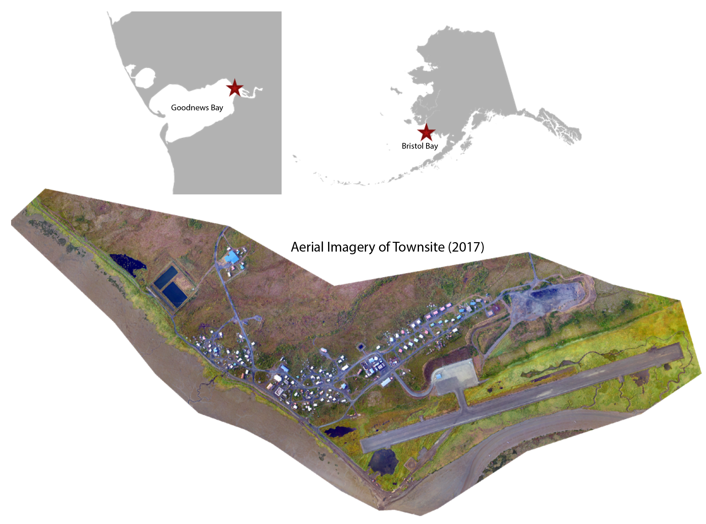
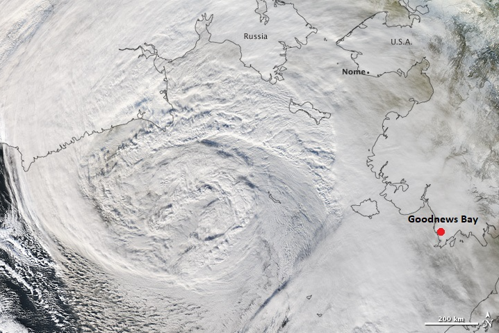
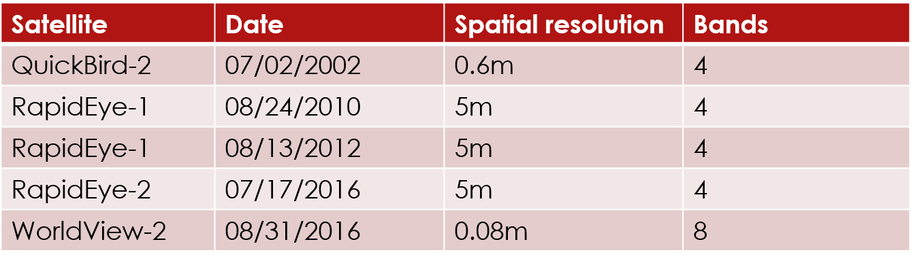
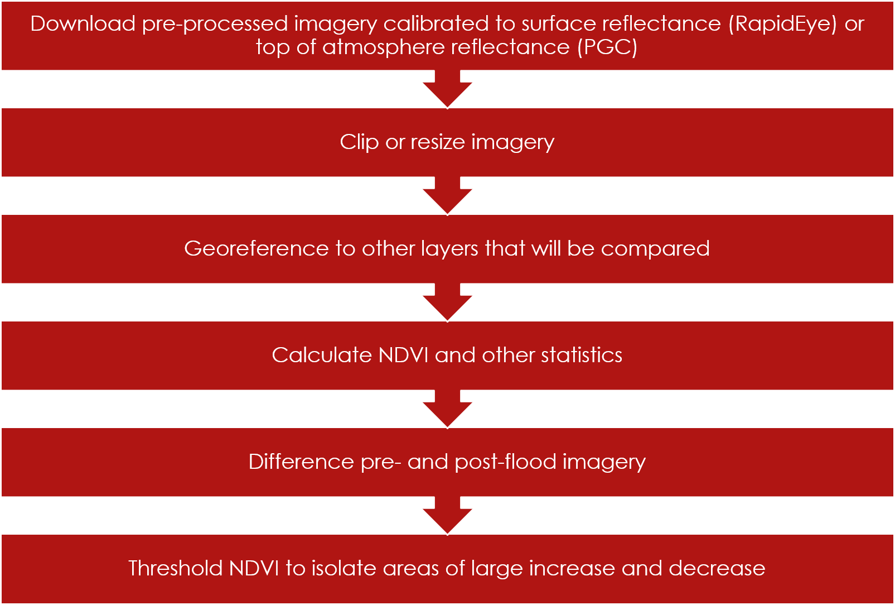
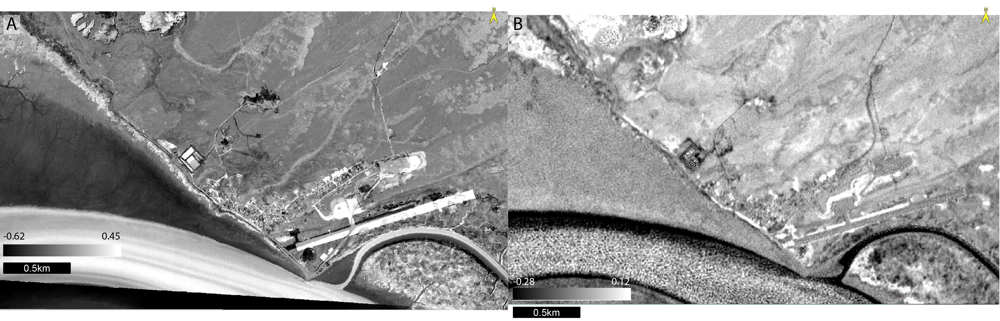
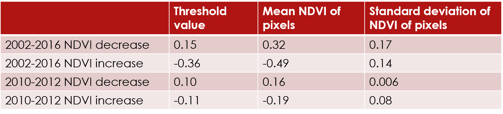
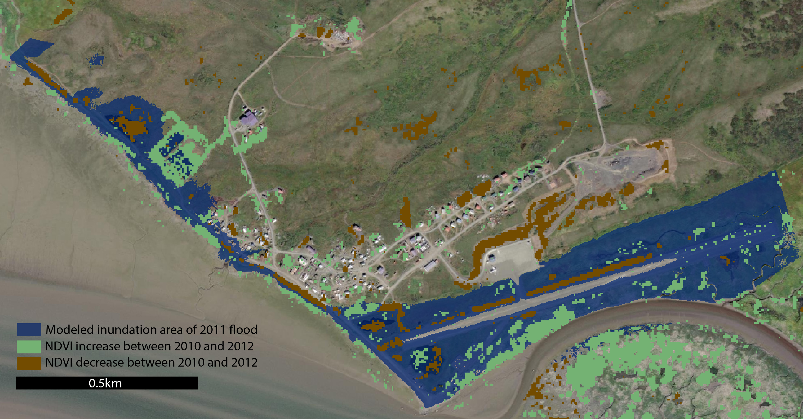
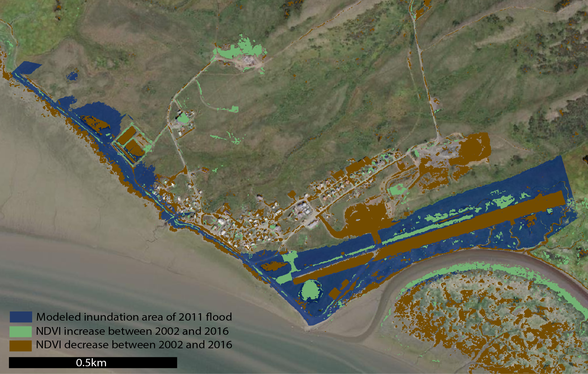

---
layout: archive
title: "Exploring methods to utilize multispectral imagery to assess historic flood height in Goodnews Bay from NDVI"
author_profile: false
---

**Harper Baldwin**
Arctic Coastal Geoscience Lab
University of Alaska, Fairbanks

## Coastal Flooding in Goodnews Bay
Coastal hazards threaten many remote Alaskan communities, which are historically underfunded and lack baseline geoscientific data. These hazards include flooding, erosion, and extreme storm events, all of which are predicted to increase in severity and frequency under climate change scenarios. The effects of flooding during storm events are difficult to model due to the complexity of bathymetric, oceanographic, and hydrologic patterns and interactions. For this reason, predicting flood extent based on meteorological storm data is challenging, but is an important goal for the improvement of flood mitigation strategies that minimize loss of property and life during flood events.

This project focuses on a potential method for delineating past flood extent based on vegetation health. The study site examined is Goodnews Bay, Alaska. This Yu’pik community is situated in northern Bristol Bay, on the eastern end of the Goodnews Bay. 

**Figure 1.** Goodnews Bay study site, which is located in northern Bristol Bay, Alaska.

This community experienced unforeseen and devastating flooding on the evening of November, 11th, 2011, when a storm with an approximately 3m storm surge height inundated the town and brought large chunks of ice into the townsite. The event caused widespread property damage, but no one was hurt despite the lack of warning from national weather stations. 

**Figure 2.** Aerial imagery of the 11/11/2011 flood that had large impacts on the community of Goodnews Bay. Image courtesy of Chris Maio.

Based on current flood assessment models, a bathtub flood model was determined for Goodnews Bay using a highly accurate DSM. Single-point flood heights from local expertise were utilized to approximate storm surge height above mean higher high water (MHHW). Despite its value as a first-order data product, these bathtub models are simplistic, and may inaccurately represent the areal extent of flooding. Validating this model is therefore an imperative for environmental safety. 

A potential method to improve the model relies on the negative effects of saltwater flooding, both physical and mechanical, on vegetation health. Studies have successfully shown the stark effects of saltwater inundation on plants (Michener and Houhoulis 1997, Kearney et al. 2009, Rodgers et al. 2009, Tahsin et al. 2018), and have used normalized difference vegetation index (NDVI) increases in freshwater reaches to delineate flood extent (Gangashe 2017), but few have used this method to delineate unknown flood extent in saltwater systems. This study site’s sub-Arctic location also makes this study unique, as the relationship between winter storms and sub-Arctic vegetation has not been explored in existing literature, which largely focuses on temperate marshland, forest, or plains (Michener and Houhoulis 1997, Kearney et al. 2009, Rodgers et al. 2009, Gangashe 2017, Tahsin et al. 2018). Literature on NDVI analysis in the Arctic and sub-Arctic focuses on the effects of climate anomalies and permafrost thaw on vegetation, and looks at trends that occur on much larger scales than this study (Walker et al. 2012, Epstein et al. 2020, Frost et al. 2021). This study attempts a new method to fill these gaps in knowledge by delineating changes in vegetation health using pre- and post-2011 flood imagery to approximate areal flood extent and compare it to the current bathtub model.

## Methods for NDVI Flood Delineation Analysis
Five images were used in this study. Due to the small extent of the study site, only sensors with a small spatial resolution were utilized, as listed below.

**Table 1.** Imagery utilized in this analysis. 

Imagery was processed as described below (**Figure 3**). Data was pre-processed to surface reflectance for RapidEye data and top of atmosphere reflectance for the other images. WorldView-2 and QuickBird-2 imagery was also pansharpened in pre-processing through the Polar Geospatial Center (PGC). Imagery was then clipped to the study area. Due to the challenges of georeferencing between images with different spatial resolution, images with the same spatial resolution were georeferenced to each other, and analyzed separately. 

**Figure 3.** Workflow for imagery processing for both PGC and RapidEye data.

Normalized difference vegetation index (NDVI) and other related statistics (such as normalized difference red edge, normalized difference water index, and scaled difference vegetation index) were then calculated between the RapidEye and PGC datasets (Jiang et al. 2006). The equation for NDVI is: **(NIR - Red) / (NIR + Red)**. For RapidEye imagery, bands used for this equation were NIR=5, and Red=3. For QuickBird: NIR=4, Red=3.  For WorldView: NIR=7, Red=5. This index relies on the unique spectral reflectance of vegetation, which has a peak in reflectance in the green wavelengths and peak in absorption in the near-infrared wavelengths. By differencing and normalizing these values, we calculate a statistic between 0 and 1 that approximates chlorophyll density in imagery.

NDVI values were then differenced between the pre- and post-flood imagery, with the corresponding image depicting areas where NDVI increased or decreased over time as having extreme values. From this image, the dataset was thresholded to assess pixels that likely increased or decreased in vegetation health over the study period. These areas of potential change were then compared to the bathtub model.
## NDVI Analysis Results

**Figure 4.** NDVI difference images for PGC 2002-2016 imagery (A) and RapidEye 2010-2012 imagery (B).

The images above depict the NDVI difference between the RapidEye imagery in 2010 and 2012 (B), and the PGC imagery between 2002 and 2016 (A). In both, high values (white) indicate areas where NDVI decreased over time, while low values (black) indicate areas where NDVI increased over time. From these images, the following thresholds were calculated based on peaks in NDVI histograms:

**Table 2.** Threshold values used to isolate areas where NDVI changed between the first and second image for both datasets.

These thresholds were then overlaid with the bathtub model of inundation from the 2011 storm, depicted in blue below. The blue area is the elevation range between MHHW and the maximum flood height recorded during the 2011 storm. With the RapidEye imagery, 0.18 square km of pixels had decreased NDVI between 2010 and 2012, while 0.25 square km had increased NDVI (**Figure 5**). In the PGC imagery, 0.42 square km of pixels decreased in NDVI between 2002 and 2016, while 0.12 square km had increased NDVI (**Figure 6**).

**Figure 5.** Thresholds from RapidEye 2010-2012 NDVI analysis overlaid on the bathtub model of inundation at Goodnews Bay.

**Figure 6.** Thresholds from PGC 2002-2016 NDVI analysis overlaid on the bathtub model of inundation at Goodnews Bay. 

The other statistics (such as NDRE, NDWI, and SDVI) that were calculated for this study are not included in results. Across all statistics, pre- and post-flood differencing highlighted similar areas, or was not effective at highlighting areas of change, based on qualitative assessment.

## Discussion of Methods Efficacy
The bathtub model and the vegetation health analysis do not match up well. However, this is most likely due to the inaccuracy of the vegetation health analysis, rather than the simplicity of the bathtub model. In the PGC imagery, between 2002 and 2016, there is a clear decrease in vegetation health over time, particularly in vegetation that is closest to the shore. However, due to the low temporal resolution of this dataset, this change cannot be attributed to the 2011 flooding event. Additionally, it fails to highlight areas that are known to have flooded, such as the  runway in the southeast region of the study site map. In the RapidEye imagery, the opposite effect on vegetation can be seen. The NDVI of the most sea-ward vegetation increased between 2010 and 2012, while vegetation closer to the townsite, at a road, decreased. This could be due to changes in road width in response to the flood, which flooded and destabilized much of the road.

Both images highlight areas where human land use change occurred between the first and second image acquisition. Changes in transportation routes and construction is evident in the areas of town where NDVI had large changes. However, amid this large signal, there is little signal that can be attributed to the small-scale effects of flooding.

Overall, this method was not successful in delineating flood extent based on NDVI changes. There are several reasons why this could be the case: 1) flooding does not affect vegetation here, 2) the available data has temporal and spatial resolution limitations that decrease ability to assess NDVI changes, and 3) flooding affects vegetation but not NDVI in this region. The first and second of these hypotheses are the most likely. The timing of storms, which occur predominantly in the winter months, could shield vegetation from the effects of flooding due to the presence of snow and ice. These plants could also already be extremophiles that are not largely affected by short-term saltwater inundation. Finally, the dataset is not ideal for studying these changes, as the RapidEye data lacks spatial resolution, and the PGC data does not provide a timeframe of analysis that can be attributed to the 2011 flood.

## Conclusions on the Proposed Method

Despite these underwhelming results, there is reason to believe that this method could work to improve the bathtub model in other sub-Arctic and Arctic communities. With appropriate datasets and ground-truthing to better understand the effects of flooding on plant communities, it is possible that this method could yield results that are comparable to the bathtub model. A more long-term ground campaign, potentially including hyperspectral imagery, would improve results.

## Acknowledgements
This project is funded by NSF grant 1848542. Geospatial support for this work provided by the Polar Geospatial Center under NSF-OPP awards 1043681 and 1559691. RapidEye data, downloaded through the Planet Data Portal, was also utilized for this analysis.

## References
Frost, G. V., Bhatt, U. S., Macander, M. J., Hendricks, A. S. & Jorgenson, M. T. (2021). Is Alaska’s Kuskokwim Delta Greening or Browning? Resolving Mixed Signals of Tundra Vegetation Dynamics and Drivers in the Maritime Arctic, _Earth Interactions, 25_(1), 76-93. [https://journals.ametsoc.org/view/journals/eint/25/1/EI-D-20-0025.1.xml](https://journals.ametsoc.org/view/journals/eint/25/1/EI-D-20-0025.1.xml)

Epstein, H. E., Walker, D. A., Frost, G. V., Raynolds, M. K., Bhatt, U., Daanen, R., Forbes, B., Geml, J., Kaärlejarvi, E., Khitun, O., Khomutov, A., Kuss, P., Leibman, M., Matyshak, G., Moskalenko, N., Orekhov, P., Romanovsky, V. E., & Timling, I. (2020). Spatial patterns of arctic tundra vegetation properties on different soils along the Eurasia Arctic Transect, and insights for a changing Arctic. _Environmental Research Letters_, _16_(1), 014008. [https://doi.org/10.1088/1748-9326/abc9e3](https://doi.org/10.1088/1748-9326/abc9e3)

Gangashe, A. T. (2017). _Assessing the impacts of flooding on vegetation cover in the Shashe- Limpopo confluence area using earth observation data._ University of the Witwatersrand.

Jiang, Zhangyan & Huete, Alfredo & Chen, Jin & Chen, Yun & Li, Jing & Yan, Guangjian & Zou, Yun. (2006). Analysis of NDVI and scaled difference vegetation index retrievals of vegetation fraction. Remote Sensing of Environment. 101. 366-378. 10.1016/j.rse.2006.01.003. 

Kearney, M., Stutzer, D., Turpie, K., & Stevenson, J. (2009). The Effects of Tidal Inundation on the Reflectance Characteristics of Coastal Marsh Vegetation. _Journal of Coastal Research - J COASTAL RES_, _25_, 1177–1186. [https://doi.org/10.2112/08-1080.1](https://doi.org/10.2112/08-1080.1)

Michener, W. K., & Houhoulis, P. F. (1997). _Detection of Vegetation Changes Associated with Extensive Flooding in a Forested Ecosystem_. 12.

Rodgers, J., Murrah, A., & Cooke, W. (2009). The Impact of Hurricane Katrina on the Coastal Vegetation of the Weeks Bay Reserve, Alabama from NDVI Data. _Estuaries and Coasts_, _32_, 496–507. [https://doi.org/10.1007/s12237-009-9138-z](https://doi.org/10.1007/s12237-009-9138-z)

Tahsin, S., Medeiros, S. C., & Singh, A. (2018). Assessing the Resilience of Coastal Wetlands to Extreme Hydrologic Events Using Vegetation Indices: A Review. _Remote Sensing_, _10_(9), 1390. [https://doi.org/10.3390/rs10091390](https://doi.org/10.3390/rs10091390)

Walker, D. A., Epstein, H. E., Raynolds, M. K., Kuss, P., Kopecky, M. A., Frost, G. V., Daniëls, F. J. A., Leibman, M. O., Moskalenko, N. G., Matyshak, G. V., Khitun, O. V., Khomutov, A. V., Forbes, B. C., Bhatt, U. S., Kade, A. N., Vonlanthen, C. M., & Tichý, L. (2012). Environment, vegetation and greenness (NDVI) along the North America and Eurasia Arctic transects. _Environmental Research Letters_, _7_(1), 015504. [https://doi.org/10.1088/1748-9326/7/1/015504](https://doi.org/10.1088/1748-9326/7/1/015504)
    

