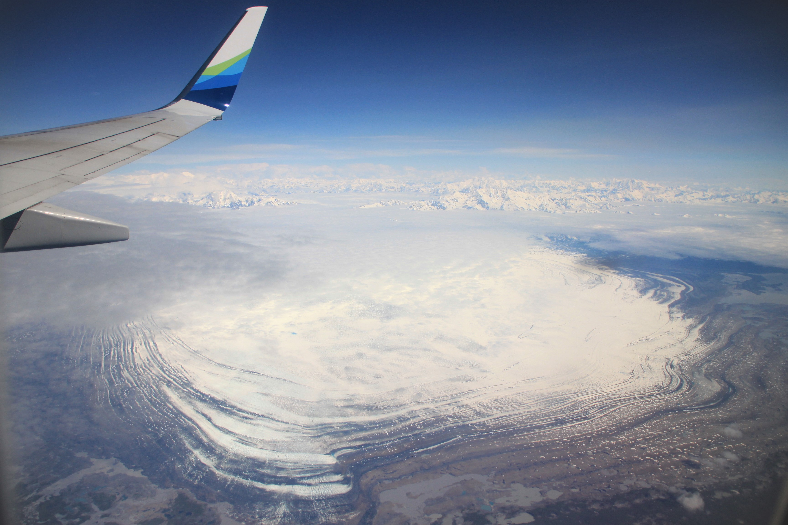
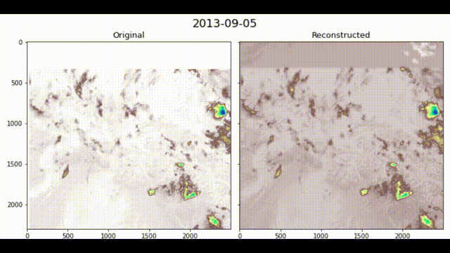
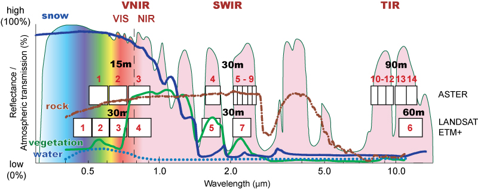
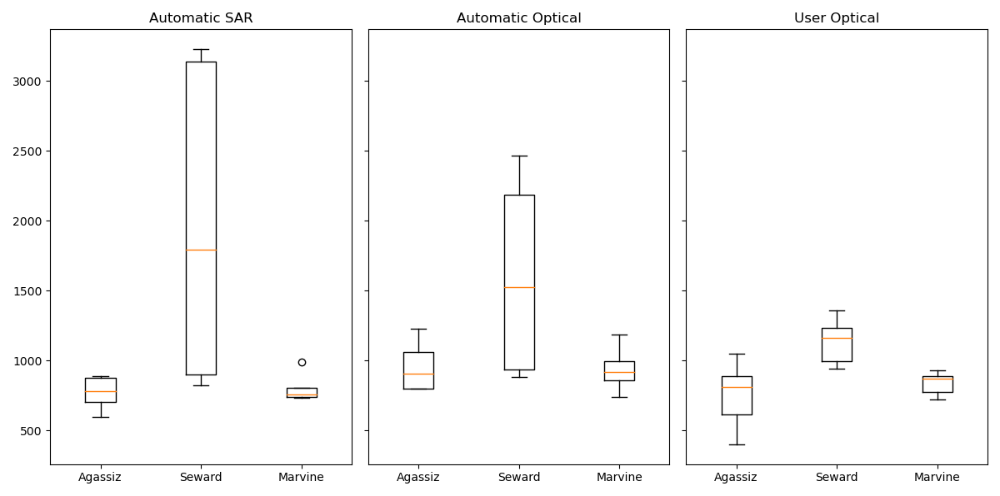
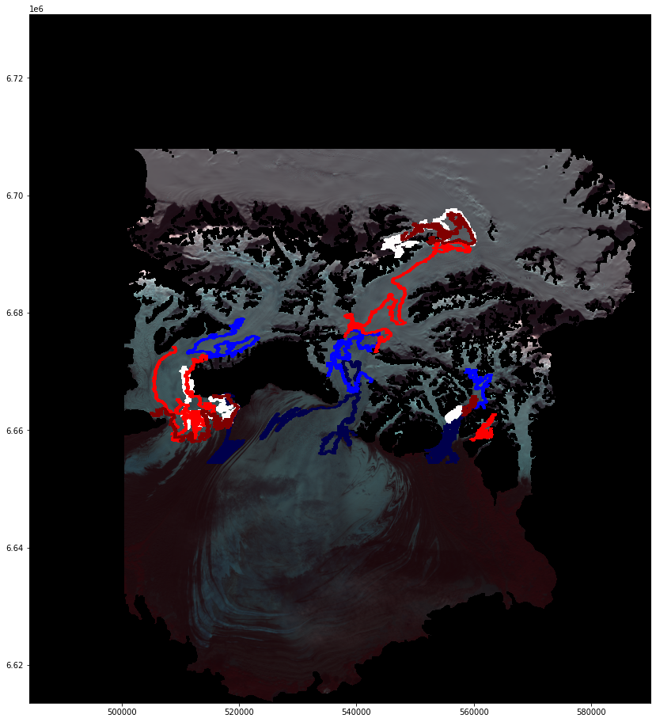

---
layout: archive
title: "A workflow for Equilibrium Line Altitude automatic/by-hand retrieval from Landsat/Sentinel images"
author_profile: false
---

**Victor Devaux-Chupin**

# A workflow for Equilibrium Line Altitude automatic/by-hand retrieval from Landsat/Sentinel images

*Sit'Tlein (Malaspina) glacier, photo from V.Devaux-Chupin*

## A bit of context

### *Sit'Tlein*
Glaciers ! Wonders of this planet, fascinating features and visible changes make them the ideal study subject for remote sensing, both SAR and Optical/Infrared. 
However sometimes studying a glacier can appear challenging, especially when you are interested in the *Sit'Tlein* (Malaspina) glacier, located in Southeastern Alaska right by the Pacific Ocean. This place is famous for its amazing amount of rainfall and constant cloud-cover, making it difficult to gather consequent dataset for analysis. 

### A possible application for the dataset
To illustrate our pipeline, we decided to attempt to build a history record of the glacier's Snow Line Altitude (SLA), or Equilibrium Line Altitude (ELA): the lowest line of continuous snow at the end of the melt season. This problem requires the latest available satellite image right before the first snowfall, usually at the end of October in this region. We only need one image per year, but as we will see it can be very challenging to obtain any clear image at all between September and October of each year. 

### Description of the workflow
We decided to create an automatic pipeline based on the Python API of Google Earth Engine (GEE) saving files on a Google Drive, directly available for analysis from a notebook hosted on Google Colab. Because of the poor quality of the dataset, we decided to apply a stochastic interpolation method borrowing tools from both machine learning and inversion methods. We then try to automatize a detection algorithm for the ELA, based on feature analysis and association of different bands from both SAR and Optical/Infrared remote sensing.

## GEE Downloading and Interpolation

### Custom download
The notebook allows the user to create satellite collections from the Landsat 5-8 and Sentinel 2 database, by taking account of several user inputs:
- Date range
- Date-pattern (eg: every year, between 01/09 - 31/10)
- Area of Interest (AOI) over which the cloud cover is calculated
- Region of Interest (ROI) for which the image is downloaded
- Cloud cover range 

These user-defined parameters allow for a great flexibility in the dataset downloading, helped with the integrated pipeline allowing for image assemblage (with the same CRS). The cloud cover for Sentinel-2 is directly calculate from the information embedded in the collection, while the Landsat 5-8 collections need a custom function to calculate and mask the cloud cover/shadows, which can lead to some complications for specific applications. 

### Stochastic Imputation
Once the dataset has been downloaded, it can appear disappointing both in the sparsity and the quality of the images. It is important to clarify right away that **we can not create real data**, just propose a synthetic approximation that follows a specific pattern determined by the dataset. This method was coded and adapted from [Salakhutdinov et.al (2008)](https://proceedings.neurips.cc/paper/2007/file/d7322ed717dedf1eb4e6e52a37ea7bcd-Paper.pdf) by Doug Brinkerhoff, whose code is available [here](https://github.com/douglas-brinkerhoff/malaspina_svd/blob/main/malaspina_svd.ipynb). He designed it to interpolate an ice velocity dataset of the Malaspina glacier: 
*Imputed velocities of the Malaspina glacier, figure by Doug Brinkerhoff*


The imputation follows two main steps:
- Fitting of two random Gaussian matrices (noise) to the data through the *Adam* optimizer (from machine learning), following the gradient of a cost function **E** composed of regularization adapted to the geometry of the problem. We iterate a *Gradient Descent* will minimizing **E**, which helps fit the random matrices at every iteration. 
- Once the **E** converges, we calculate a lower-rank Singular Value Decomposition (SVD) of the product of our two random matrices in order to orthogonalize their principal modes. From the products u,s,v of this operation we can reconstruct a dataset that will present no gaps, interpolating both in time and space our original dataset.

In a nutshell, this algorithm is more efficient the bigger the dataset, and the more random the patterns of each "slice" (image in our case): if a recurrent pattern happens, it will be picked up by the interpolation but might also be appearing whenever this pattern is not present in reality. 
For example, we noticed a fresh patch of snow most years well below the SLA of the Seward glacier. It appears that this snow is most likely blowed by the wind coming down from a steeper, higher glacier perpendicular to the flow of the main tributary (Seward glacier, see picture below). 

This method is computationally intensive and useful for big dataset, but can quickly show limits for smaller ones. 

*Imputation for Satellite images (dataset of 40 images)*

### ELA Extraction

We designed two ways to pick up the ELA:
- Through a user-designed line picking (using mainly the NIR band)
- Automatically from thresholding images (using the Normalized Difference Snow Index, NDSI)

*Snow reflectance along optical/infrared Spectrum*

We use NIR and NDSI (GREEN/SWIR) because the snow is easily mistakable with clouds, but those bands are good at differentiating the two. The NIR is better than the NDSI to differentiate snow/ice, but the NDSI is better to differentiate moraines/snow. 

While one method is more tedious than the other, it also bears much better results (the human brain being more efficient than algorithms to detect some patterns). In addition to that, each dataset (SAR and Optical) have different length in data availability. We were not able to retrieve data prior to 2017 with Sentinel-1, while the optical dataset presents slices too empty to interpret with the eye, or with the algorithm. The date availability is then:
- Optical (by hand): 2013-14 / 2018-21
- Optical (automatized): 2018-21
- SAR (automatized): 2017-21

The hand-picking method consists in reading images one after the other on Python, with a program that saves the coordinates of a mouse-click. The user can then browse through the images and click on the ELA.

The automatic method consists in calculating a threshold with which the image will be converted to 0s and 1s. This threshold is chosen by taking the mean values of ablation areas. Then, a *scipy* package extracts the boundaries between 0s and 1s, and by filtering these boundaries by size we obtain likely ELAs. This method is highly depending on the threshold value, and the results obtained were not satisfying. This threshold is at the heart of the image processing, and will be improved in the future to propose a hybrid between SAR and Optical images. 

## Some results
The following images display the automatic picking by the algorithm, along with altitude profiles of retrieved ELAs (by hand and automatically). We can notice how erratic the ELA looks like with the automatic program, even though some of them might make sense, most of them seem unrealistic. The boxplot confirms what we think by showing a strong difference in retrieved ELAs. However, some results are encouraging, it seems the NDSI (Optical) and SAR automatic ELA picked up values fairly close to the User (by-hand) ones for the Marvine and Agassiz glaciers. The Seward is poorly treated by the automatic script probably because the snowline varies a lot, and some snow can be blown on the glacier from smaller tributaries (which tempers with the algorithm to find the ELA). 
However these graphs can be coincidental, because the ELA shapes taken by the program are often very far from the ones a User would pick.
*SAR/Optical Automatic and User (by-hand) ELAs*

And this is what this image shows: a User would pick-up an ELA that looks fairly straight, or at least not varying a lot in altitude. But the SAR images shows just that for every glacier: the ELAs shapes are anything but straight, and show a lot of altitude variation. The boxplots we show above are means, which impacts our analysis.
*SAR retrieved ELA, dark red = 2021, dark blue = 2017*

## Conclusion
We presented some tools allowing to retrieve the ELA of a glacier, automatically or not, from easily downloadable GEE images. We chose not to display our code for the imputations because the process is very intensive for the RAM (at least 64 GB required for 174 Landsat/Sentinel images), and it is not tailored to be adaptive to any dataset yet. It will be implemented in this post with a notebook example when ready. The ELA picking algorithm also needs more work to be fully automatic for any user, we will also display it in this post when ready. Otherwise, you can already use the [GEE Downloader](https://colab.research.google.com/drive/1cLrGGJRJIwI5NfK-CCvDkXuVUDpixbR5?usp=sharing).


## Workflowchart

```mermaid
graph TD
A[Date/ROI/AOI] -->B[(Landsat/Sentinel Images)]
B --> C[Stochastic Imputation]
C --> D[User ELA]
C --> E[Automatic ELA]
F(Ablation Shapefile) --- E
G(Chosen Threshold) --- E
D --> H[DEM fitting of ELAs]
E -->H
H --> I[(ELAs altitudes)]

