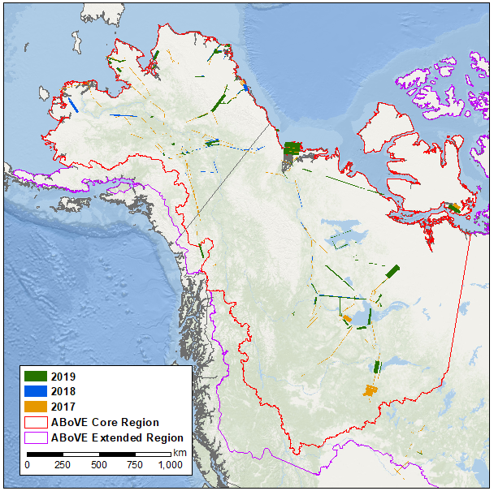
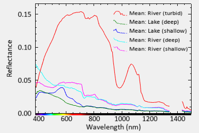
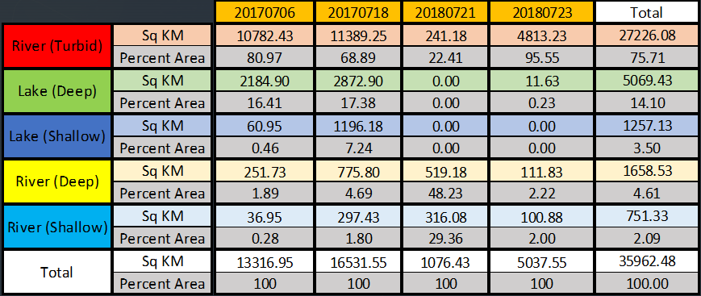
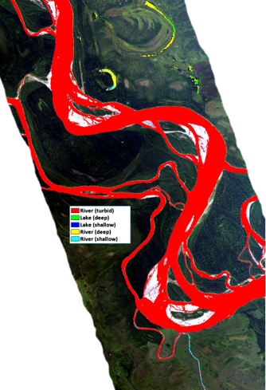
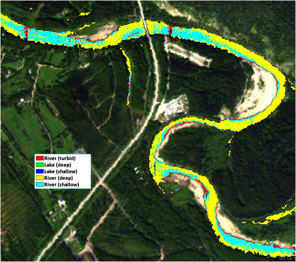
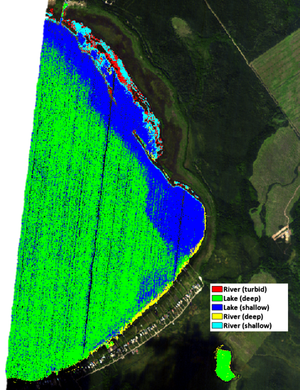

---
layout: archive
title: "Spectral Classification and Mapping of Alaskan Interior Water Bodies"
author_profile: false
---

**Josh Monroe** 

## Introduction
Water comprises 71% of the Earth. Only 3% of that water is freshwater and 2.5% of it is unavailable for use, locked in ice or far below the Earth's surface. That means that only 0.5% can be utilized for freshwater aquatic organisms, human consumption, and agricultural use. The importance of this 0.5% cannot be understated. 

Therefore, it is important to evaluate and understand freshwater from an aquatic ecology point of view. How is it being utilized and how do its properties influence that use? Turbidity is one such property which is a major driver of ecological relationships in water. Varying levels of turbidity can impact primary production, fish predation, and reproduction. Due to the role that optical properties play in aquatic ecology, it's important to understand the spatial distribution of optically dissimilar water bodies to determine how their properties influence aquatic ecosystems (Li 2016). Differences in optical properties can be observed from airborne sensors as the increase in suspended sediments or algal particles usually associated with turbidity have unique spectral signatures (Cui 2022). 

The Arctic is a region that is being disproportionately impacted by climate change. Effects associated with increased glacier melt and algal production can be analyzed within Interior Alaska water bodies. For this reason, Alaska is poised for examination of optical properties associated with coarse dissolved organic matter (CDOM) and turbidity. However, accessibility to Alaskan Interior water bodies is challenging and expensive due to the limited urbanization of the state. Therefore, remote sensing can play a key role in bridging the gap to assist with analyzing the spatial distribution and classification of the optical properties of water within Interior Alaska. 

## Methodology
In order to evaluate water bodies of the Alaskan Interior, hyperspectral data is useful to classify optical properties because of the narrow spectral resolution (Shafique 2003). The NASA-funded Arctic Boreal Vulnerability Experiment (ABoVE) flight campaigns of 2017, 2018, and 2019 conducted hyperspectral imaging surveys of Alaska and Western Canada (Figure 1). The flights made use of the Airborne Visible/Infrared Imaging Spectrometer - Next Generation (AVIRIS-NG) sensor aboard a Twin Otter airplane. The AVIRIS-NG sensor provides data at 5-meter spatial resolution and 5-nanometer spectral resolution. This feasibility study makes use of a subset of the imagery, namely those collected in Interior Alaska during the following dates: 20170706, 20170718, 20180721, and 20180723. Images are available via the Oak Ridge National Laboratory (ORNL) Distributed Active Archive Center (DAAC) in L1 radiance or L2 reflectance products (Miller 2017-2019).

Figure 1. NASA ABoVE Flight Campaigns with AVIRIS-NG Sensor

Once the L2 reflectance images were collected, spectral endmembers were obtained from user-defined regions of interest (ROIs) within the 20170718 image (Figure 2). These endmember spectra are collected to represent specific morphological characteristics of freshwater. An endmember was collected in the following locations: Turbid River, Deep River, Shallow River, Deep Lake, and Shallow Lake. 

Figure 2. Morphological Reflectance Endmembers

Following endmember collection, the modified Normalized Difference Water Index (mNDWI) was calculated per Xu 2006 for all images. The application of mNDWI was intended for use on multispectral images which cover a greater spectral range for each band (Luo 2017). For hyperspectral images, one can utilize the average of the full range of the given spectral range or one band that is located in the middle of the spectral range (Liu, 2020). For this study, the individual band value was used. Therefore, mNDWI is calculated per equation 1 with band 38 (562 nm) representing the green band and band 256 (1654 nm) representing the shortwave infrared band. 

Equation 1. mNDWI = (b38 - b256)/(b38+b256)

The resulting mNDWI image is then thresholded using a value of 0.4 to produce a water mask that contains only pixels with mNDWI exceeding this value. This operation will drastically decrease processing time for downstream operations and reduce additional errors associated with non-water pixels. 

Spectral Angle Mapping (SAM) Classification is then employed to assign a classification to the input images based on the previously acquired morphological endmembers. A spectral subset of 110 of 425 bands, between 380 and 920 nanometers, are used for the operation along with a spectral angle threshold of 0.3. The 110 bands of the input images will be compared to the spectral endmembers and each pixel assigned to one of the five classes based on spectral similarity (Garg 2017). Lastly, statistics are performed on the SAM output to determine spatial coverage and areal extent of the classified results. 

## Analysis
The results of the classification show regions which are spectrally similar to the input endmembers. The summary statistics output is shown in Table 1. In total, there were 36,000 square kilometers of freshwater classified. 

Table 1. SAM Classification Results

The Tanana River is located in several locations within the four hyperspectral images. In all images, the sections of the Tanana River were mapped to the turbid river endmember (Figure 3). This makes logical sense as the endmember representing the turbid river is the most unique of the five morphological classes. The turbidity associated with the Tanana River is largely caused by sedimentation from glacial run-off. The high silt content causes the unique spectral signature when compared to other optical properties. This endmember and the pixels classified as such are primarily composed of non-Algal particles on the optical triangle chart proposed by Prieur et. al. 1981. 

Figure 3. SAM Classification Tanana River 20180723 

The Chena River and rivers of similar size are classified with more spectral complexity when compared to the Tanana River. An example output of the Chena River is shown in Figure 4. Sections of the river are classified as deep river, shallow river, and turbid river. The shallow and turbid sections are mostly contained to the inside corners which occurs because these regions tend to have slower water and deposit more sediment. An examination of the deep and shallow river endmembers show spectra that are indicative of moderate turbidity. The shallow river endmember has a spectral signature that shows optical characteristics from algal and non-algal particles. The red and near infrared regions are higher than the deep river endmember which may come from the increase in primary productivity in shallow regions of the river. 

Figure 4. SAM Classification Chena River 20170718

Harding Lake and other large stagnant water bodies of the Interior were classified with primarily deep and shallow lake endmembers (Figure 5). Issues with hyperspectral striping are most evident in the lakes of the study region and stand out in the classification output. Reference spectra for the lakes suggest low turbidity in deep sections and a contribution of colored dissolved organic matter (CDOM) in the shallow sections as indicated by the small peak in the yellow portion of the spectrum (Grunert 2017, Wen 2016)).

Figure 5. SAM Classification Harding Lake 20170718

The process of mapping spectral characteristics does have a few challenges. Firstly, hyperspectral data commonly having striping issues as discussed previously. These striping patterns cause issues with the thresholding and classification steps and lead to commission and omission errors. Secondly, smaller order streams can have a lot of noise and have varying degrees of success with spectral classification. In some cases, thresholding may exclude sections of water that have overhanging vegetation. Lastly, classification in urban areas is challenging where optical characteristics may be defined by human induced factors. The 20180723 image included a water bodies close to the city of Fairbanks, Alaska which were classified with no dominant class but significant noise for all classes. These challenges were specific to certain scenarios but should be taken into consideration when implemented at a larger scale. Further studies should also utilize standardized endmembers for the classification to ensure that spectra are representative of a given optical characteristic. 

## Conclusion
The spectral angle mapper classification is a useful tool for examining spectral similarity. This use case of identification of primary constituents of inland water bodies exemplifies its utility. The regions examined in this study provide a small subset of the Alaskan Interior but initial examination indicates that this procedure can be implemented at a larger scale with additional imagery from future flight campaigns. Within the study region, turbid rivers comprised primarily of non-algal particles made up the majority of the water bodies. Pixels classified as shallow river made up the least amount of water body area. 

Overall, the optical characteristics of the water bodies were found to be inherently tied to the morphology of the freshwater system.  Flow rates and discharge are important factors to consider when understanding these optical constituents. As the Arctic continues to warm, due to climate change, the characteristics of inland water bodies may change both spatially and temporally. Examination of water via spectral mapping can be utilized in the future to characterize these optical properties and quantify how they change. 

## Literature Cited

Chen, Xu, et al. "Changes in turbidity and human activities along Haihe River Basin during lockdown of COVID-19 using satellite data." _Environmental Science and Pollution Research_ 29.3 (2022): 3702-3717.

Cui, Mengying, et al. "Water Turbidity Retrieval Based on UAV Hyperspectral Remote Sensing." _Water_ 14.1 (2022): 128.

Garg, Vaibhav, et al. "Spectral similarity approach for mapping turbidity of an inland waterbody." _Journal of hydrology_ 550 (2017): 527-537.

Grunert, Brice K., Colleen B. Mouw, and Audrey B. Ciochetto. "Characterizing CDOM spectral variability across diverse regions and spectral ranges." _Global Biogeochemical Cycles_ 32.1 (2018): 57-77.

Li, Sijia, et al. "Spatiotemporal characterization of chromophoric dissolved organic matter (CDOM) and CDOM-DOC relationships for highly polluted rivers." _Water_ 8.9 (2016): 399.

Liu, Y., and C. C. Xiao. "Water Extraction on the Hyperspectral Images of GAOFEN-5 Satellite Using Spectral Indices." _The International Archives of Photogrammetry, Remote Sensing and Spatial Information Sciences_ 43 (2020): 441-446.

Luo, Xin, et al. "A water extraction method based on airborne hyperspectral images in highly complex urban area." _2017 International Workshop on Remote Sensing with Intelligent Processing (RSIP)_. IEEE, 2017.

Miller, C.E., R.O. Green, D.R. Thompson, A.K. Thorpe, M. Eastwood, I.B. Mccubbin, W. Olson-duvall, M. Bernas, C.M. Sarture, S. Nolte, L.M. Rios, M.A. Hernandez, B.D. Bue, and S.R. Lundeen. 2019. ABoVE: Hyperspectral Imagery from AVIRIS-NG, Alaskan and Canadian Arctic, 2017-2019. ORNL DAAC, Oak Ridge, Tennessee, USA. [https://doi.org/10.3334/ORNLDAAC/1569](https://doi.org/10.3334/ORNLDAAC/1569)

Prieur, Louis, and Shubha Sathyendranath. "An optical classification of coastal and oceanic waters based on the specific spectral absorption curves of phytoplankton pigments, dissolved organic matter, and other particulate materials 1." _Limnology and Oceanography_ 26.4 (1981): 671-689.

Shafique, Naseer A., et al. "Hyperspectral remote sensing of water quality parameters for large rivers in the Ohio River basin." _First interagency conference on research in the watershed, Benson, AZ_. Citeseer, 2003.

Wen, Z. D., et al. "Influence of environmental factors on spectral characteristics of chromophoric dissolved organic matter (CDOM) in Inner Mongolia Plateau, China." _Hydrology and Earth System Sciences_ 20.2 (2016): 787-801.

Xu, Hanqiu. "Modification of normalised difference water index (NDWI) to enhance open water features in remotely sensed imagery." _International journal of remote sensing_ 27.14 (2006): 3025-3033.
