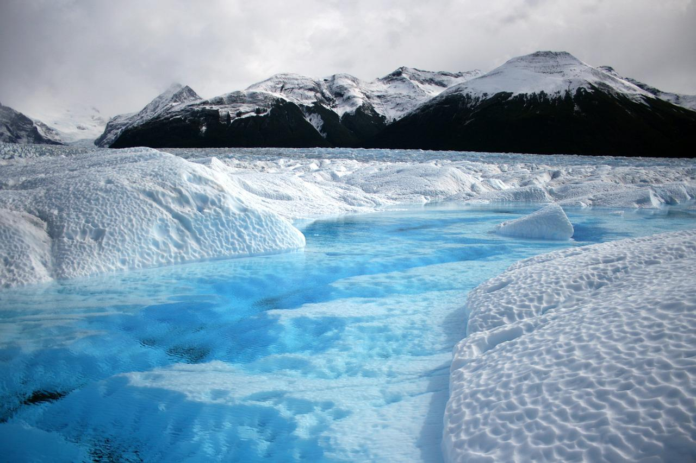

**Jane Doe's 2022 VIRS project**

**Written by Jane Doe**

This blog post shows you how to estimate the depth of melt ponds on the Ross Ice Shelf, Antarctica. We will be using Sentinel-2 near-infrared (NIR) and red reflectance observations. Our approach relies on the strong absorption of liquid water in the NIR, which causes the NIR reflectance of melt ponds to decrease with depth.

The blog post first walks you through a simple workflow (adapted from [Moussavi et al.](https://doi.org/10.3390/rs12010134)). It then presents results from the austral summers of 2018-2021, highlighting the increased melt pond abundance during the warm summer of 2020.

*Not quite the same thing.*

## Why it matters
xxx
## The key idea
xxx
## Analysis of Sentinel-2 data
xxx
## Increased pond abundance on the Ross Ice Shelf in 2020
xxx
## Summary and next steps
xxx

