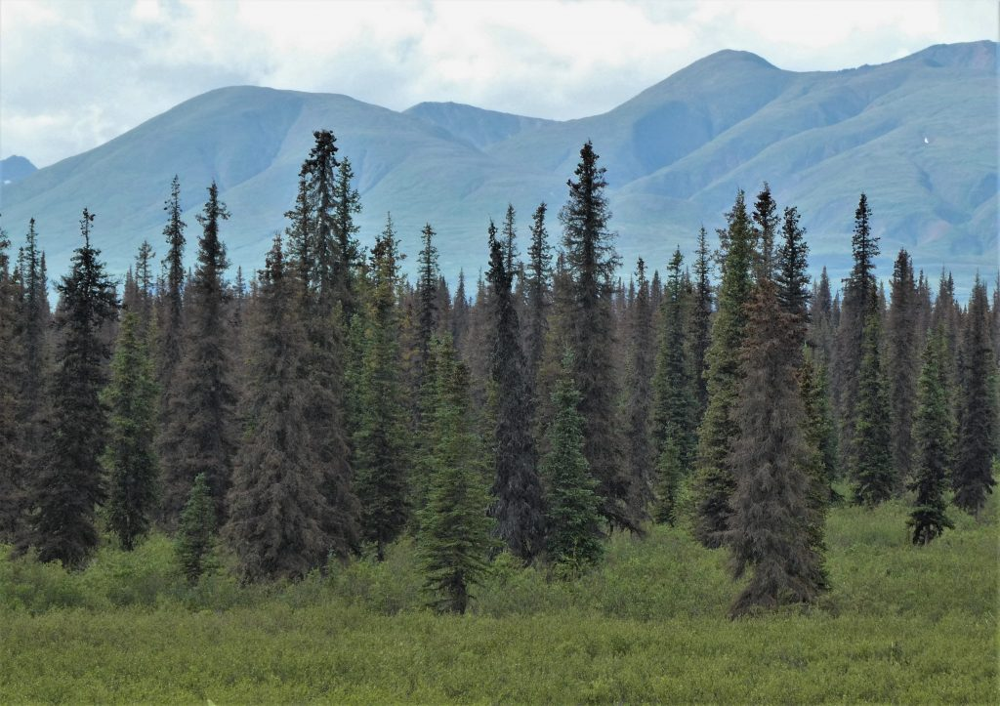
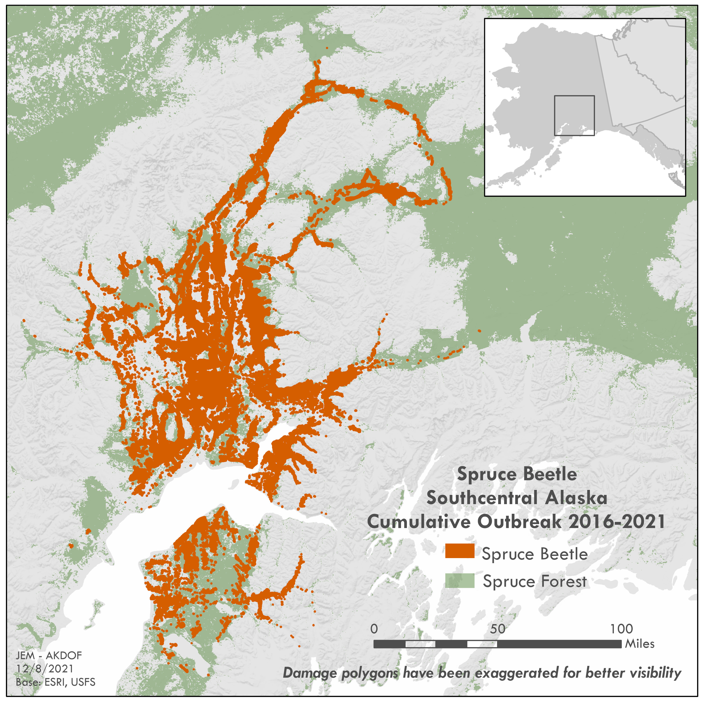
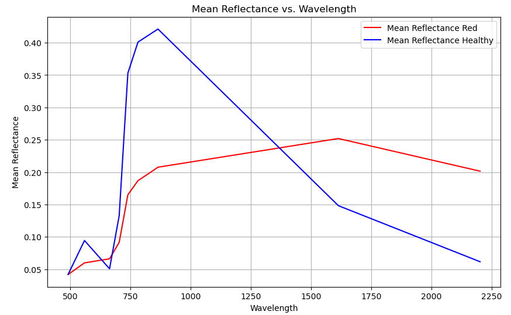
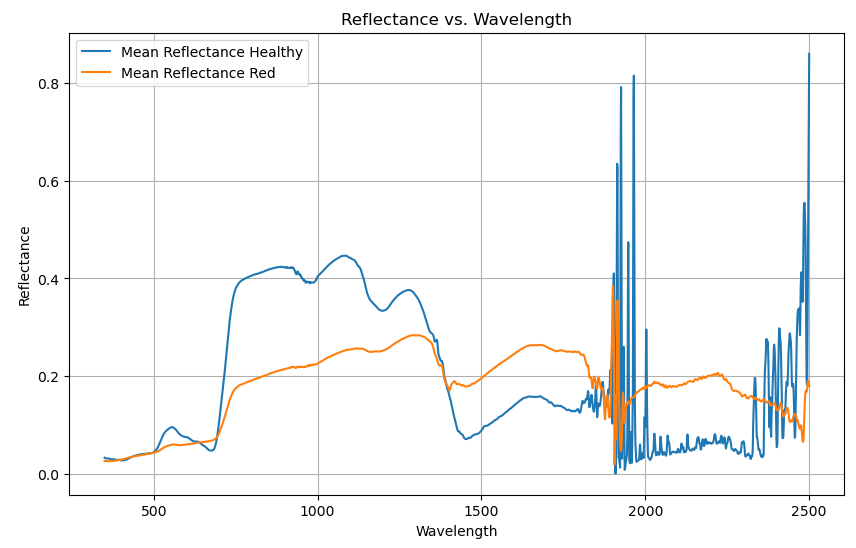
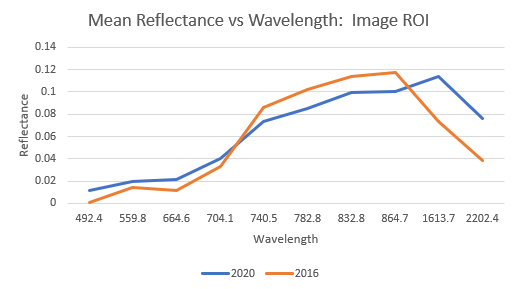
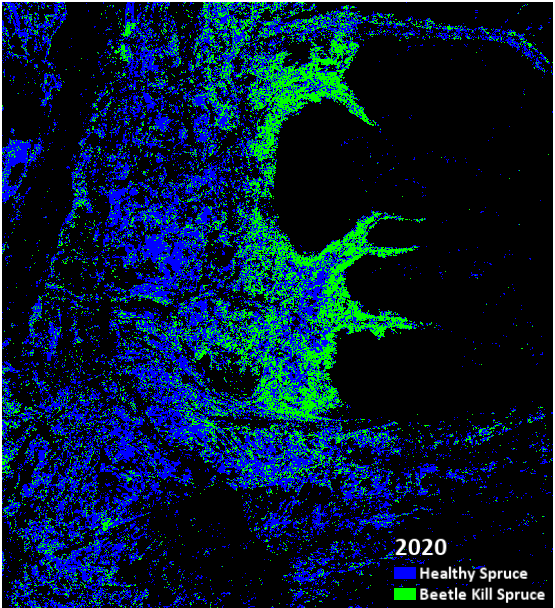
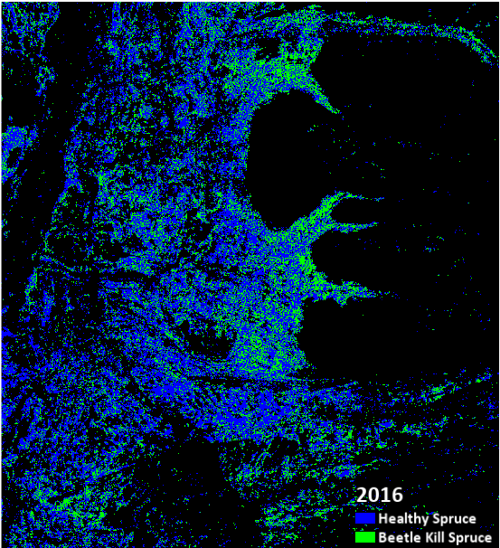

---
layout: archive
title: "Beetle kill spruce detection in Alaska's MSB"
author_profile: false
---

**Kathleen DeMichele**

Alaska’s Matanuska-Susitna Borough (MSB) has been experiencing a wide spread spruce bark beetle infestation since 2016. Areas of late-stage infestation, or beetle kill, can be found across the area.  Dead standing spruce increases fire hazard in already fire prone boreal forests. Identification of beetle kill spruce via remote sensing can aid in wildfire hazard assessment for communities. 

The objective of this project is to explore remote sensing methods to detect areas of late infestation, or  beetle kill spruce, with Sentinal-2 imagery. After reviewing published works and available datasets spectral profiles from 2016 and 2020 imagery were explored for difference between healthy and beetle kill spruce. 
*Dead standing spruce due to beetle infestation in the Denali Borough*

## More beetles, more fires 
Spruce bark beetles occur naturally in Alaska's forests and are primarily found in felled-trees in normal conditions. Environmental factors, such as warming temperatures, can create an increase in bark beetle habitat and favorable conditions for reproduction. With the right conditions bark beetle populations swell and begin effecting live standing spruce. The current outbreak is estimated to have effected more than 2.17 million acres of mixed spruce and birch forests since 2016. The outbreak has been the most active in the Northern MSB, the southern Denali Borough and in some areas of the Kenai Peninsula. While the activity is showing notable decreases in some areas, the outbreak appears to be shifting to new forest areas indicating the outbreak will continue to affect Alaskan forests (USFS). 

 Wildfires are also a natural occurrence in Alaska's forests. With climate change Alaska (and many other areas) have experienced increases in wildfire frequency, size and areas burned. Dead spruce trees increase fire hazard as they provide a hot, fast-moving fuel source that can be difficult to control. As beetle infestations have washed through areas of Alaska's forests they leave behind forest more vulnerable to fire than in typical conditions. 

Alaska's MSB  contains an abundance wildland urban interface areas where loss of life and infrastructure from wildfire is often highest . Fire risk evaluation based on proximity to dead standing spruce at the community level  could be beneficial to many residents and emergency managers in these communities. 
 
## Existing work and research
Previous studies have explore detection of early to late stage beetle infestation in boreal forests. An investigation of hyperspectral reflectance of healthy and stressed coniferous trees found the most sensitive ranges for tree stress identification are 709.3 to 722.7nm. This range corresponds to the red edge portion of the of the spectrum where wavelengths are  most closely related to chlorophyll content (Masaitis).  A separate study focused on early infestation using Sentinal-2 imagery identified bands 2 (blue), 4 (green) , 5 (red edge 1), 11 (SWIR 1), and 12 (SWIR 2) as having significant differences between infested and control plots (Huo).  The forest service has mapped damage of the current infestation in Alaska via aerial detection survey and publishes yearly status maps and statistics. Forest service maps are not available as downloadable datasets, hence the need for a dataset that can be used with other fire relevant data. 
 *Map of detected spruce beetle damage by the US Forest Service.*
## Data
Sentinel-2 MSI data was selected for this project because of its inclusion of red -edge bands that have been identified as useful in the detection of beetle infected spruce. Availability of level 2A data in 2016 or earlier is limited so level 1C data was downloaded and processed to level 2A via Sen2Cor for two images collected on 08-31-2016 and  08-20-2020. All further analysis to the imagery took place using ENVI software. A study area was selected that includes areas of known heavy infestation and multiple MSB communities of various size.   Both images were clipped to the study area. 
Conifer top cover raster data available from ABoVE (Macander) was used to identify areas of primarily spruce. A binary threshold was applied to the raster to classify areas as 'conifer' or 'not conifer'. 'Not conifer' areas were masked out of the 2016 and 2022 images. All further analysis was preformed on masked images. 

##  Spectral properties of healthy  and unhealthy spruce 
A 2022 dataset of spectrometer readings of healthy and red state (late stage infestation) white spruce in the Denali Borough was provided by Simon Zwieback for exploration.  Reflectance values recorded for wavelengths 350 to 2500 were recorded for a selection of healthy and red state trees. All healthy reflectance values  were averaged together for each wavelength and the same was calculated for red state data. A spectral profile was then graphed based on the mean values for each. A simplified version was also graphed for easier comparison to the wavelengths available in Sentinal-2 imagery. 

*Spectral profile of healthy vs red (beetle kill) spruce from spectrometer data. Wavelengths expressed in nanometers (nm)* 

*Simplified spectral profiles from spectrometer data.*

Using the Senitnel-2 images an area known to have high spruce mortality lead to the selection of 4 small regions of interest (ROIs). The ROIs were selected by comparing the masked images with the band combination SWIR 1, Red Edge 1 and NIR as it displayed a significant and identifiable visible difference between the images.  Average values of the combined ROIS for each band were calculated for each image. 

*Spectral profiles of ROI in 2020 and 2016.  2020 values represent beetle kill (red stage) spruce. Wavelength values on x-axis correspond to Sentinal-2 bands.* 

Based on the spectral profiles of the spectrometer data and in previous works a notable difference was expected in NIR, Red edge bands and SWIR bands. SWIR1 (1613.7nm)  was the only band display a significant and consistent gap between the identified health and unhealthy spruce in the Sentinal-2 imagery. 

##  Mapping beetle kill spruce 
With SWIR 1  displaying the most noticeable difference between health and unhealthy spruce the Normalized Burn Ratio (NBR) was determined to be a good indicator or spruce health. NBR is an index using SWIR 1 (band 11) and NIR (band 8) commonly used to identify forest areas effected by forest fire. The NBR can be used for forest loss detection more generally and can be a good indicator of beetle kill because it is sensitive to vegetation stress such as changed in chlorophyll content and moisture. Using a normalized index also reduces the effect of topographic and atmospheric conditions. 

The NBR images were then used to create  binary classification with the tool 'Binary Raster by Automatic Threshold' to more clearly identify areas of beetle kill spruce. The method used to calculate the threshold was otsu, which is a histogram shape-based method. 

*Classified conifer tree cover  for 2020 and 2016*

## Discussion  
Despite unfulfilled expectations for detection using red edge wavelengths of the sentinal-2 data beetle kill spruce was still detectable using SWIR wavelengths. Hyperspectral imagery may provide more opportunity to exploit the red edge wavelengths for a more detailed analysis. Due to the availability of the conifer tree top cover dataset and the prevalence of NIR and SWIR bands to  in platforms beyond Sentinal-2 ( e.g. Landsat) beetle kill detection can be performed effectively over diverse areas and temporal spans. To further improve the current NBR output the perimeters of both the 2015 Sockeye fire and the 2019 McKinley fire can be masked to eliminate these areas as being identified as beetle kill for the current study area. 

This is an ongoing infestation and the results of analysis such as this will change as new areas of forest become infested while others recover. Up to date datasets that track these areas of higher fuel load can be beneficial as we approach another fire season. Overlaying the findings of this project with community or infrastructure data, such as power line locations, can aid in decision making and mitigation strategies for wildfire. 

##  References 

United States Forest Service (2023). Alaska Region: Spruce Beetle.  https://www.fs.usda.gov/detailfull/r10/forest-grasslandhealth/?cid=FSEPRD536861

Spruce Beetle in Alaska's Forests (2018). https://www.alaskasprucebeetle.org 

Macander, M.J., and P.R. Nelson. 2022. ABoVE: Modeled Top Cover by Plant Functional Type over Alaska and Yukon, 1985-2020. ORNL DAAC, Oak Ridge, Tennessee, USA. https://doi.org/10.3334/ORNLDAAC/2032

Masaitis G, Mozgeris G, Augustaitis A (2013). Spectral reflectance properties of healthy and stressed coniferous trees. iForest 6: 30-36. - doi: 10.3832/ifor0709-006

L. Huo, E. Lindberg, J. E. S. Fransson and H. J. Persson, "Comparing Spectral Differences Between Healthy and Early Infested Spruce Forests Caused by Bark Beetle Attacks using Satellite Images," IGARSS 2022 - 2022 IEEE International Geoscience and Remote Sensing Symposium, Kuala Lumpur, Malaysia, 2022, pp. 7709-7712, doi: 10.1109/IGARSS46834.2022.9883420

Rautiainen, M.; Lukeš, P.; Homolová, L.; Hovi, A.; Pisek, J.; Mõttus, M. Spectral Properties of Coniferous Forests: A Review of In Situ and Laboratory Measurements. Remote Sens.  2018, 10, 207. https://doi.org/10.3390/rs10020207

