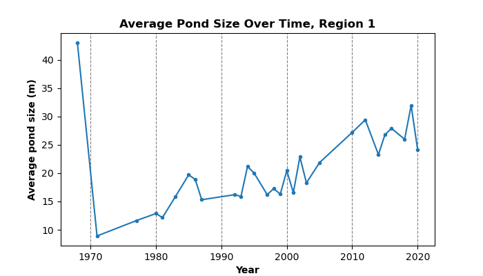

**Olivia Hobgood**

The first time I went to Prudhoe Bay, Alaska, it was the middle of July. While my friends back home in Fairbanks were enjoying the hot summer weather, I was brushing snow off my pack as I shuttled gear into the Arctic Oilfield Hotel. The oil rig workers laughed as they explained how snow in July isn't unusual here. In this place without trees, where the tundra was not fully green but still a palette of sleepy browns, I felt as if I was stepping backwards in time to the last snowy days of spring.

In reality, that impression was not too far off the mark. Here on the northern coast of Alaska, the average temperature just barely dips above freezing during the three summer months. Last winter's snow still lingered along the shady riverbanks. Just a month from now, the plants would be preparing to freeze again. As an incoming master's student interested in Arctic science, it was my job to become familiar with this alien landscape. The hope was that somewhere along my journey across the tundra, I would find a question that needs answering.

*Caribou grazing along the Arctic Coastal Plain. Photo courtesy of Paul Laustsen, USGS.*

### A geometric mosaic of ice

From the Dalton highway, the Arctic Coastal Plain appeared breathtakingly bland -- the landscape is flat as far as the eye can see, with few deviations. However, as I hiked out onto the tundra for the first time, I was shocked by how complex it actually was. What appeared to be a flat landscape was actually made up of a vast network of raised polygons. It was like the ground was covered in crocodile scales. Many of them had marshy centers and raised rims along their perimeters. On the way to my research group's study site, I zigzagged across these raised rims to keep my feet from sinking into the marshy soil. Other polygons had flat, dry centers and sunken, water-filled troughs between them. I tried jumping over these trough ponds, but some were so wide and deep that I flooded my boots in the process.

*Polygonal ground on the North Slope of Alaska as seen from above. The mix of polygons with either depressed or drained centers, as well as the presence of many flooded trough ponds, is typical at Prudhoe Bay. Photo courtesy of Christian Zimmerman, Alaska Science Center.*

The senior scientists explained to me that these polygons, called [ice-wedge polygons](https://www.erdc.usace.army.mil/CRREL/Permafrost-Tunnel-Research-Facility/Massive-Ice/), are unique to the coldest regions of the globe. When it gets very, very cold during the winter, the surface of the ground contracts so much that it cracks. When the snow melts in the spring, water fills these cracks. In fall, the water expands as it freezes, pushing the sediment up and expanding the cracks. The cycle continues, and more ice accumulates with each passing year. Over hundreds of years, massive blocks of solid ice, called ice wedges, come to occupy the space between polygons.

*A diagram showing how ice wedges are distributed in polygonal ground, underneath the perimeters of the polygons. The trough is the depression where the ground cracks in the winter, usually at the center of the ice wedge. The polygon rims are the raised perimeters where the expansion of the ice wedges pushes up sediment. Raised rims trap water in the center basins. The active layer is the top portion of the soil that thaws out in the summer. At Prudhoe Bay, it is typically less than three feet deep. Below that is the permafrost, the portion which has remained frozen for at least two consecutive years -- sometimes for hundreds or even thousands more.*

As I dumped water out of my boots for the second time, the scientists also explained to me that these treacherous trough ponds were a very new phenomenon. Because ice wedges are made up of mostly ice, they are especially vulnerable to thaw. In just the past couple of decades, warmer than average temperatures had caused the top of the ice wedges to thaw so much that the ground sank and collapsed around them. Water had drained out of the formerly wet polygon centers and was pooling in the largest and deepest of these depressions. The subsidence of thawing ground ice is called thermokarst, so these new water bodies were called thermokarst ponds. In just the past few decades, thermokarst ponds had begun popping up all over the Arctic. We quickly learned that they were just one symptom of a completely altered landscape. As ice wedges thaw, large areas of tundra are [draining](https://www.uaf.edu/news/archives/news-archives-2010-2021/embargo-march-14-widespread-ice-wedge-thawing-seen-throughout-arctic.php), infrastructure is [collapsing](https://grist.org/science/alaska-permafrost-thawing-ice-climate-change/), and wildlife habitat is [changing](https://www.fs.usda.gov/pnw/sciencef/scifi186.pdf).

*Drained ice-wedge polygons as seen from above. Note the large, interconnected thermokarst ponds between them. 30 years ago, this landscape would have looked much different. Photo by Guido Grosse.*

Interestingly, [not all areas are changing equally](https://www.mdpi.com/2072-4292/10/8/1312). Although some regions have been dramatically transformed by subsidence, other regions appear relatively unchanged -- they have few ponds, and the polygons look about the same as they did 50 years go. This is why I had to alternate between zigzagging across raised rims and jumping between drained centers. After returning from my field trip, I kept thinking about the variety in the landscape I saw. Which areas have changed the most? How long ago did this change start? Is there a clear association with climate data? I set out to answer these questions through remote sensing.

### Visualizing a landscape of change

To look at differences in landscape change between different areas, we needed a detailed record of their pond formation. One perk of studying the landscape at Prudhoe Bay is that the oil field companies have commissioned and maintained a large archive of historical imagery. Every year, they fly planes equipped with powerful cameras that capture strikingly high resolution images of the landscape below. By viewing them in sequence, we can actually watch the landscape transform through the formation of ponds. And we can see where it hasn't changed as much, too!

*A sequence of historical images over two different locations. The area on the left has had many more thermokarst ponds form in comparison to the area on the right. The area on the right has polygons with low centers and raised rims, which are often visibly filled by water.*

To make the visualization above, I acquired a series of aerial photographs from Quantum Spatial (now NV5) with permission from BP and Hilcorp. The images, which spanned years from 1968 to 2020 (over half a century!), were taken during the snow-free summer months, when the ground is visible. Each image is made up of a grid of pixels. Low values represent dark spots, and high values represent bright spots. The images were taken at several different scales, with several different pixel sizes. Some of the images had hundreds of pixels per square meter of ground; others had thousands. I had to add spatial information to the older images by aligning them with GPS coordinates in ArcGIS Pro. To display all the images in the same location and on the same scale, I loaded the imagery into Python using the rasterio and xarray packages -- publicly available packages of code used for processing image data. Most of the images were taken in black and white, meaning that all of the pixels in them had just one value. Some of the newer images were true color, meaning that each pixel had a red, green, and blue value. To make these images black and white, I took the mean value of these three colors.

### Classifying the ponds from the imagery

Seeing landscape change is cool. However, if I wanted to answer my questions about landscape change, I needed more than a visualization -- I needed numbers. With numbers for pond area in each image, I could make direct comparisons between regions and compare the expansion of the ponds with climate data. To accomplish this, I set out to delineate the ponds in each image. I could draw the boundaries by hand, but this would take a lot of time, and it wouldn't be transferrable to other regions. Instead, I decided to write a code to delineate them automatically. The ponds are consistently darker than the other areas in each image. However, because the images have varying illumination, I couldn't choose one value and decide all pixels darker than that value are ponds -- I had to choose a different value for each image. Otsu thresholding is one method that can be used to automatically determine a threshold between two classes of pixels. It works by looking at the distribution of all pixel values in an image, then finding the value that creates the most contrast, or variance, between the groups of pixels below and above that value. It is commonly used to delineate water bodies. If you are interested in the math behind this technique, you can read more about Otsu thresholding [here](https://www.baeldung.com/cs/otsu-segmentation).

*An animated gif showing how Otsu thresholding works. This graph depicts a histogram of all the pixel values in an image -- for example, there are about 250 pixels in the image with a value of 50. For each possible pixel value, the algorithm computes the variance between the groups above and below that value. When it has gone through the entire range of values, it chooses the value with the highest variance between groups as the threshold.*

Using Otsu thresholding, I got decent results, but not quite the results I wanted. Both shadows and shallow ponds in low polygon centers were put into the same class as the thermokarst ponds. The thermokarst ponds were quite a bit darker, so to hone in on this, I used multi-Otsu thresholding. Multi-Otsu thresholding determines two or more cutoffs instead of just one. I created two cutoff values and then used the lowest one. You can read more about the precise method I used [here](https://www.semanticscholar.org/paper/A-Fast-Algorithm-for-Multilevel-Thresholding-Liao-Chen/b80914dbbee9f6b2455742d8117417731e6ecf12). Using the lower of two cutoffs ensured that just the darkest water bodies fell below the threshold.

Although Otsu thresholding did a good job distinguishing thermokarst ponds, it also produced some unwanted results. Some of the images were noisy, so some isolated pixels outside of ponds were dark enough to fall below the threshold. Plus, big lakes -- which are also deep and dark -- were also making their way into the classification. Both of these could be distinguished from the thermokarst ponds by their size. To eliminate these, I assigned each group of connected water pixels a unique area ID. Areas made up of fewer than 50 pixels or more than 10,000 pixels were assigned the same value as non-water pixels.

Unfortunately, in some images, this wasn't good enough. The big lake I was trying to filter out has a pale sediment bottom, and depending on the surface conditions, sometimes the palest portions fell above the threshold. This segmented the lake into pieces that couldn't be distinguished from thermokarst ponds by their size. I couldn't find an easy way to remove the lake without manually delineating it, so I decided to remove the years when it was an especially big problem. I had over 50 years of imagery -- I could afford to leave some out! However, I did keep the images where the problem was only minor. So long as most of the pond area was contributed by thermokarst ponds in a given image, I was happy with my results.

*A gif showing the final classified pond areas overlaid on the original imagery.*

### Interpreting the data

Finally, it was time to pull out some numbers. I graphed the total area, average size, and number of the ponds in each year's image. To investigate the relationship between pond formation and climate, I also plotted mean annual temperature and precipitation data from the nearby Deadhorse airport for the same range of years. The resulting plots are below.

Out of the above figures, percent area -- the percent of each image covered by ponds -- is probably the best metric to look at for ponding onset and timing. Pond area really took off in the late 1990s to the early 2000s. The sharp upward trend is undeniable, but we can see that it fluctuates quite a lot from year to year. We can see that pond number is closely correlated to pond area -- when pond area is high, so is the number of ponds. The average size of the ponds looks a bit strange due to this trend. There was just one medium-size pond in 1968, but because it was the only one, its average size was well above the average over multiple ponds in later years. Outside of this single-pond year, the upwards trend makes sense. Many ponds grow bigger over time as they are expanded by thaw, but the continued appearance of new, small ponds dampens this trend by lowering the average.

When looking at the corresponding temperature and precipitation data, we see that the mean annual temperature has also been increasing -- but not to the same degree as the pond area. Although pond area has increased sharply in the past two decades, mean annual temperature has been increasing more gradually for a longer period of time. Plus, it has fluctuated quite a bit. There does not appear to be a single especially hot year that corresponds to an especially abrupt increase in pond area. I had hypothesized that extra summer rainfall could be responsible in part for the large fluctuations in pond area throughout the 2000s, but this does not appear to be the case, either -- at least not where the data is available. Unfortunately, precipitation data was absent during several years of high pond area fluctuations. The lack of trends between these variables could indicate that other climate variables play a bigger role -- such as the length of time spent above freezing, snow depth, and snow melt. If there appears to be no strong trend between pond area and these other characteristics, it may be that the landscape has reached something that is called "tipping point" -- at some point, the ground got warm enough that ponds began to form, and now that they're present, they will cause further thaw even if temperatures cool down. Research continues to be done regarding whether or not these ponds are self-perpetuating. Several [recent studies](https://www.nps.gov/articles/000/ice-wedges-2022.htm) show that many ponds have stabilized in recent years, and their underlying permafrost is no longer degrading. This makes it unlikely that a tipping point has already been reached. However, it is unknown whether this stabilization trend will continue, especially as temperatures continue to rise.

### Looking forwards

We have already seen that comparing thermokarst ponds with simple climate data in just one area brings up a lot of interesting discussions. This same methodology can be used to look at multiple areas, many of which have much more detailed environmental monitoring efforts taking place within them. Because Prudhoe Bay is road accessible, many researchers use it as a study site. There is a wealth of data available for the region on things like soil conditions, ground temperatures, vegetation, and hydrology. In the future, I plan to repeat this analysis over several others areas which are being used as vegetation monitoring sites, including the area I showed with fewer ponds forming on it. My goal is to find relationships between landscape history, vegetation, and permafrost thaw. Other researchers may bring this data into even more complicated analyses. Such analyses could be used to develop models which predict how the Arctic will change under different future conditions. I hope it will bring us one step closer to understanding the future of the Arctic.

*A rainbow over the Trans-Alaska Pipeline in the northern foothills of the Brooks Range, part of the drive up to Prudhoe Bay. The future of this unique and vital landscape is dependent on the outcomes of Arctic research.*
